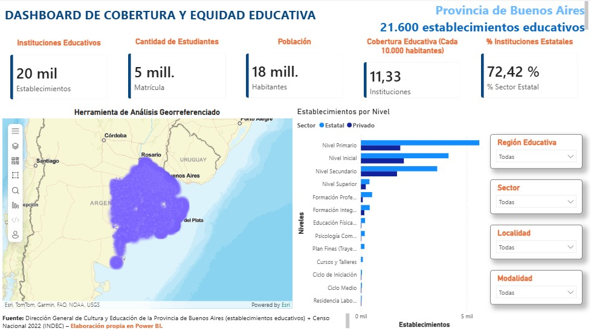

readme_content = """# 📊 Sistema de Inteligencia de Datos: Cobertura y Equidad Educativa (PBA)


*> Vista previa del Dashboard interactivo desarrollado en Power BI Desktop.*

---

## 📌 Descripción del Proyecto

Este proyecto aborda la integración, modelado y visualización analítica de la infraestructura de **establecimientos educativos** en los 135 municipios de la Provincia de Buenos Aires, combinando registros administrativos oficiales con datos demográficos del **Censo Nacional de Población 2022 (INDEC)**.

El objetivo principal es proporcionar un tablero de control ejecutivo georreferenciado que permita evaluar la **cobertura escolar, la equidad de infraestructura y la distribución del sector público vs. privado** en el territorio bonaerense.

---

## 🏗️ Arquitectura de Datos y Modelado Dimensional

El modelo fue construido siguiendo los estándares de **Modelado Dimensional en Esquema en Estrella (Star Schema)** y las mejores prácticas de Business Intelligence.

```
   +--------------------+          +-----------------------+
   |   Dim_Ubicacion    | 1      * | Fact_Establecimientos |
   +--------------------+----------+-----------------------+
   | municipio_nombre   |          | clave                 |
   | region_educativa   |          | nivel                 |
   | area               |          | sector                |
   | población_2022     |          | matricula             |
   +--------------------+          | latitud / longitud    |
                                   +-----------------------+
                                               | *
   +--------------------+                      |
   |   Dim_Calendario   | 1                    |
   +--------------------+----------------------+
   | Date / Anio / Mes  |
   +--------------------+

```

```

* **`Fact_Establecimientos` (Tabla de Hechos):** Registra el detalle granular de cada oferta educativa (~21.600 registros), sus matrículas y sus coordenadas geográficas exactas.
* **`Dim_Ubicacion` (Dimensión Geográfica):** Contiene los municipios únicos (1 fila por distrito) e incorpora la población del Censo 2022. Garantiza una cardinalidad de **Uno a Muchos ($1 : *)$** para prevenir duplicaciones de población al aplicar filtros.
* **`Dim_Calendario` (Dimensión Temporal):** Tabla creada mediante sintaxis DAX para soporte de inteligencia temporal.
* **`_Medidas` (Tabla Contenedora Pura):** Tabla dedicada de forma exclusiva a centralizar las medidas explícitas en DAX.

---

## 🛠️ Proceso ETL y Limpieza de Datos (Power Query)

1. **Estandarización y Calidad de Origen:**
   * Importación de datasets CSV con codificación `UTF-8` y delimitador de punto y coma (`;`).
2. **Normalización Espacial:**
   * Reemplazo de separadores decimales (`.` por `,`) en las columnas de `latitud` y `longitud` y conversión de tipo de datos a `Número Decimal (1.2)` para su correcto renderizado en sistemas GIS (ArcGIS).
3. **Integración Demográfica mediante Combinación de Consultas (*Merge*):**
   * Combinación por coincidencias aproximadas (*Fuzzy Matching*) entre `Dim_Ubicacion` y el dataset censal, logrando una tasa de coincidencia perfecta del **100% de los distritos (135/135 municipios)**.
4. **Optimización de Granularidad:**
   * Depuración de atributos de menor jerarquía (como `ambito`) en la dimensión para evitar ambigüedades en la agregación territorial.
   * Deshabilitación de carga de consultas intermedias para optimizar la memoria RAM del motor VertiPaq.

---

## 🧮 Lógica de Negocio y Medidas DAX Clave

Todas las métricas fueron desarrolladas mediante medidas explícitas en la tabla contenedora `_Medidas`:

* **Total de Establecimientos Únicos:**
  ```dax
  Total_Establecimientos = DISTINCTCOUNT(Fact_Establecimientos[clave])

```

* **Matrícula Total:**
```dax
Total_Matricula = SUM(Fact_Establecimientos[matricula])

```


* **Población Consolidada:**
```dax
Poblacion_Total = SUM(Dim_Ubicacion[población_2022])

```


* **Indicador de Cobertura (Escuelas por cada 10.000 Habitantes):**
```dax
Establecimientos_por_10k_Hab = DIVIDE([Total_Establecimientos], [Poblacion_Total] / 10000, 0)

```


* **Porcentaje del Sector Estatal (Con gestión de contexto dinámico):**
```dax
Porcentaje_Estatal = 
VAR TotalZona = CALCULATE([Total_Establecimientos], ALL(Fact_Establecimientos[sector]))
RETURN DIVIDE([Establecimientos_Estatales], TotalZona, 0)

```


---

## 📐 Estructura del Dashboard y UX/UI

1. **Pestaña 1 (Tablero Control Ejecutivo):**
* **Banner KPI Superior:** Indicadores de impacto resumen (*Total Establecimientos*, *Matrícula*, *Escuelas c/ 10k Hab.* y *% Sector Estatal*).
* **Análisis Espacial:** Mapa interactivo con clústeres geográficos basados en coordenadas reales.
* **Análisis de Oferta:** Gráfico de columnas apiladas comparando niveles educativos (Inicial, Primaria, Secundaria, Superior) divididos por sector.
* **Filtros Dinámicos:** Segmentadores por *Región Educativa* y *Sector*.


2. **Pestaña 2 (Soporte Territorial):**
* Mapa esquemático de las 25 Regiones Educativas oficiales de la Provincia de Buenos Aires para contraste de política pública.


---

## 📁 Estructura del Repositorio

```
├── Final_CienciaDeDatos_PowerBI.pbix   # Archivo principal de Power BI Desktop
├── data/
│   ├── establecimientos-educativos.csv # Dataset primario de escuelas
│   └── poblacion-pba.csv               # Dataset censal demográfico INDEC 2022
├── img/
│   ├── dashboard_preview.png          # Captura de la pantalla principal
│   └── regiones_preview.png           # Captura del mapa de regiones
└── README.md                           # Documentación técnica del proyecto

```

---

## 👤 Autor

* **Edgardo Sandoval**
* *Estudiante Avanzado de Ciencia de Datos e IA | Business Intelligence Analyst*
"""
